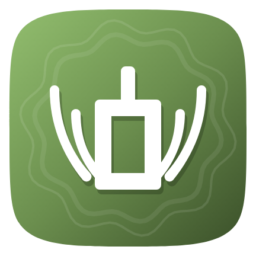
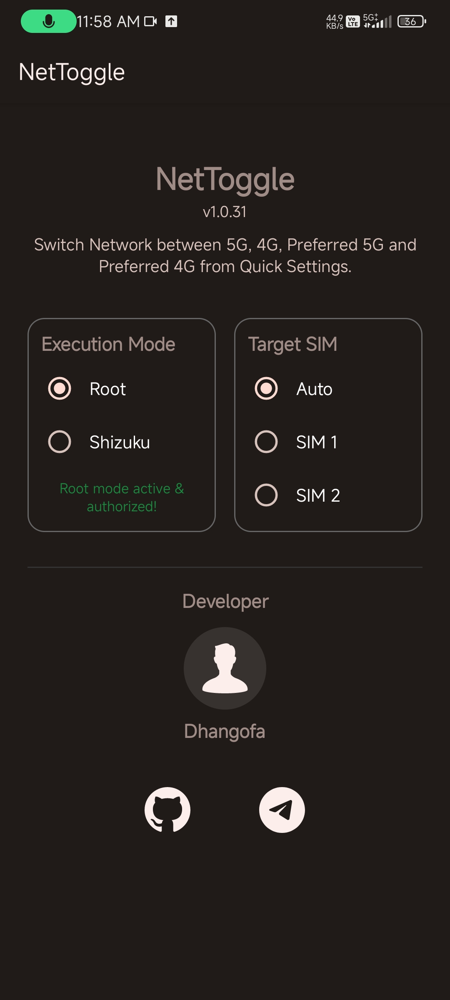
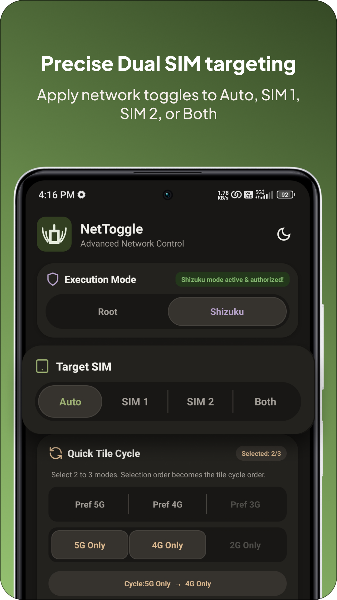
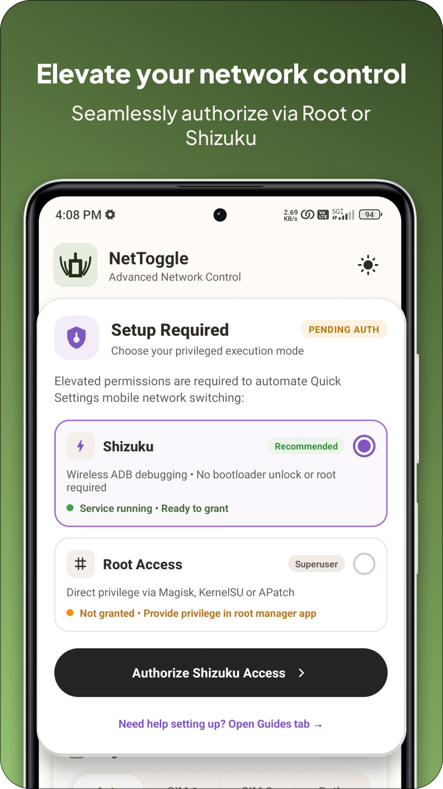
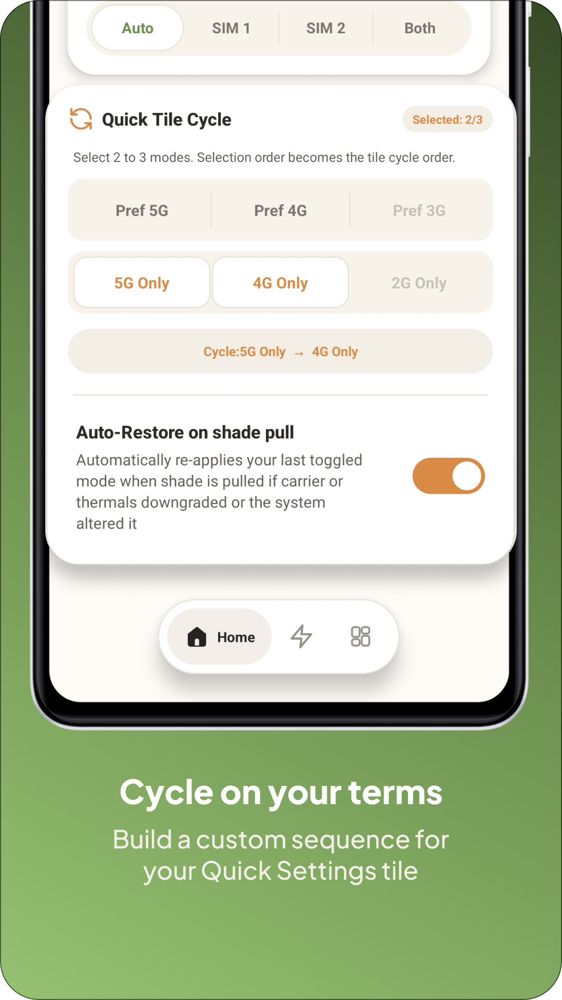
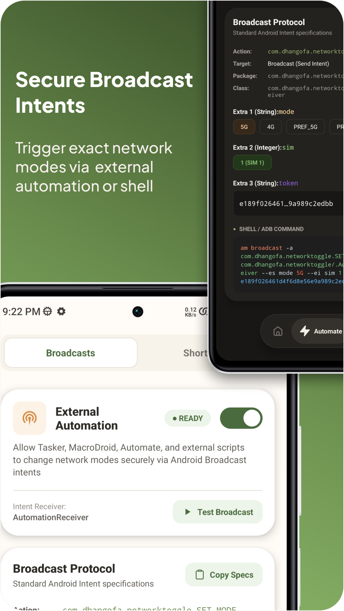

# NetToggle

  
    
  

## 📖 Description
NetToggle is a lightweight Android Quick Settings tile application designed to force specific cellular network modes directly from your status bar. It allows you to quickly cycle through **4G Only**, **5G Only**, **Pref 5G**, and **Pref 4G** with a single tap, bypassing the standard Android settings menus entirely.

## 🚧 Why It Was Made
Modern Android skins, often restrict or completely hide advanced network mode selections (such as locking the device strictly to 5G or 4G to prevent unwanted network drops). Furthermore, standard third-party Android apps are only providing pref 4G and pref 5G not locking to 4G only or 5G only. 

NetToggle bridges this gap by completely bypassing standard Android APIs. Instead of asking the system to change the network, it executes raw baseband telephony shell commands (`cmd phone set-allowed-network-types-for-users`) as a privileged user, ensuring immediate and guaranteed network switching. 

## 📸 Screenshots

| Configuration UI | 4G Only | 5G Only | Preferred 5G | Preferred 4G |
| :---: | :---: | :---: | :---: | :---: |
|  |  |  |  |  |

## ⚙️ Working Modes & Requirements
To execute the privileged baseband commands, NetToggle requires an elevated execution environment. It features a built-in UI to select between two independent working modes:

### 1. Root Mode (`su`)
* **Requirements:** A rooted device (e.g., Magisk, Apatch or KernelSU).
* **How it works:** Executes the telephony command directly through the system's superuser binary.
* **Benefits:** Zero background overhead, completely self-contained, and survives device reboots without any manual intervention.

### 2. Shizuku Mode (ADB)
* **Requirements:** The [Shizuku](https://shizuku.rikka.app/) application installed and active.
* **How it works:** Routes the telephony command through Shizuku's background binder daemon, utilizing the native telephony permissions of the standard ADB shell user (`UID 2000`).
* **Benefits:** Allows the app to function perfectly without requiring full system root.

## 📱 Supported Android Versions
* **Minimum Required:** Android 7.0 (API Level 24)
* **Target Version:** Android 16 (API Level 36)
* **Tested on:** MIUI 14 (Android 13), OriginOS 6 (Android 16)
