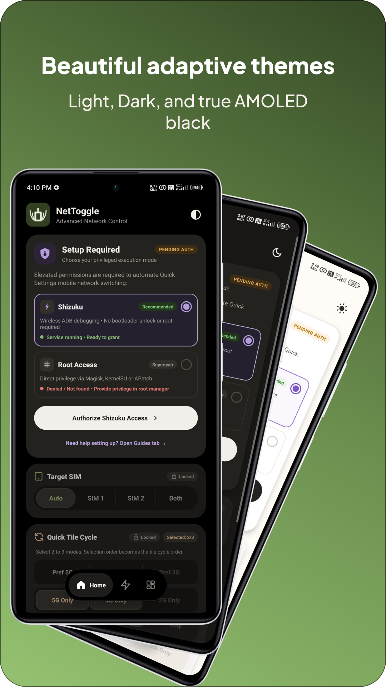

# NetToggle

<div align="center">
  
  <br><br>
  <a href="https://github.com/dhangofa/NetToggle/releases/latest">
    
  </a>
</div>

[](https://rookieenough.github.io/Orion-Data/redirect.html?id=nettoggle)

## 📖 Description
NetToggle is a lightweight Android Quick Settings tile application designed to force specific cellular network modes directly from your status bar. It allows you to quickly cycle through **4G Only**, **5G Only**, **Pref 5G**, and **Pref 4G** with a single tap. NetToggle uses privileged shell access to apply network mode changes that are normally unavailable to standard Android apps.

## 🚧 Why It Was Made
Modern Android skins, often restrict or completely hide advanced network mode selections (such as locking the device strictly to 5G or 4G to prevent unwanted network drops). Furthermore, standard third-party Android apps are only providing pref 4G and pref 5G not locking to 4G only or 5G only. 

NetToggle bridges this gap by completely bypassing standard Android APIs. Instead of asking the system to change the network, it executes raw baseband telephony shell commands (`cmd phone set-allowed-network-types-for-users`) as a privileged user, direct network mode switching on supported devices/ROMs. 

## 📸 Screenshots

<div align="center">

<table>
  <tr>
    <td align="center">
      <strong>5G Only</strong><br><br>
      
    </td>
    <td align="center">
      <strong>4G Only</strong><br><br>
      
    </td>
  </tr>
  <tr>
    <td align="center">
      <strong>Preferred 5G</strong><br><br>
      
    </td>
    <td align="center">
      <strong>Preferred 4G</strong><br><br>
      
    </td>
  </tr>
  <tr>
    <td align="center" colspan="2">
      <strong>Configuration UI</strong><br><br>
      
    </td>
  </tr>
</table>

</div>

## ⚙️ Working Modes & Requirements
To execute the privileged baseband commands, NetToggle requires an elevated execution environment. It features a built-in UI to select between two independent working modes:

### 1. Root Mode (`su`)
* **Requirements:** A rooted device (e.g., Magisk, Apatch or KernelSU).
* **How it works:** Executes the telephony command directly through the system's superuser binary.
* **Benefits:** Zero background overhead, completely self-contained, and survives device reboots without any manual intervention.

### 2. Shizuku Mode (ADB)
* **Requirements:** The [Shizuku](https://shizuku.rikka.app/) application installed and active.
* **How it works:** Routes the telephony command through Shizuku's background binder daemon, utilizing the native telephony permissions of the standard ADB shell user (`UID 2000`).
* **Benefits:** Allows the app to function perfectly without requiring full system root.

## 📱 Supported Android Versions
* **Minimum Required:** Android 7.0 (API Level 24)
* **Target Version:** Android 16 (API Level 36)
* **Tested on:** MIUI 14 (Android 13), OriginOS 6 (Android 16)

## 🔐 Privacy

NetToggle does not contain ads, analytics, trackers, telemetry, or background network communication.
The app only opens external links when the user manually taps the GitHub or Telegram icons in the configuration screen.
No personal data is collected, stored, or transmitted by NetToggle.
## 🛠️ Build From Source

NetToggle can be built using the standard Android Gradle toolchain.

```bash
git clone https://github.com/dhangofa/NetToggle.git
cd NetToggle
./gradlew assembleRelease
```
## 📜 License
NetToggle is licensed under the **GNU General Public License v3.0**.
See the [LICENSE](https://github.com/Dhangofa/NetToggle/tree/main/LICENSE) file for the full license text.

## 🧾 Notices

NetToggle includes or references the following icon and brand assets:

- The NetToggle launcher icon was created for this project using AI-assisted generation and manual vector editing. It is distributed under the same GPLv3 license as NetToggle.
- The Quick Settings network icon was created for this project and is distributed under the same GPLv3 license as NetToggle.
- The GitHub mark is a trademark of GitHub, Inc. It is used only as an external link icon to the NetToggle GitHub repository and is not used as the NetToggle app logo or product identity.
- The Telegram mark is a trademark of Telegram. It is used only as an external link icon to the developer Telegram profile/support link and is not used as the NetToggle app logo or product identity.
- The developer/person icon is adapted from an Icooon Mono icon asset.

See [NOTICE.md](https://github.com/Dhangofa/NetToggle/tree/main/NOTICE.md) for more details.
